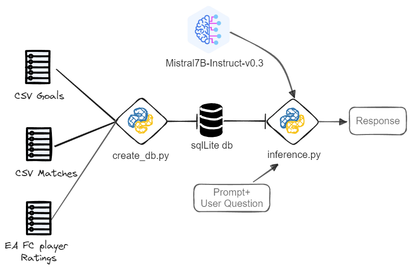

# Football Rag Chat

Using FIFA data to get insights from football matches

Data sources: 
- [FIFA matches | Kaggle](https://www.kaggle.com/datasets/zeesolver/fifa-results?resource=download)
    This data is the historical record of official matches and contains both the results as well as the details of the goals and minute they were scored.

- [EA FC ratings | Kaggle](https://www.kaggle.com/datasets/stefanoleone992/ea-sports-fc-24-complete-player-dataset?select=male_players.csv)
    In this data source only the `male_players.csv` file is used. Its preprocessed to use the latest data available (EA FC 24 Game) and a small subset of columns.

The approach for this demo consists of creating a SQLliteDB from the csv files which will be fed to the LLM and the SQL agent using Langchain, the LLM selected is Mistral 7B-InstructV0.3. (See Figure below)



In order to access this Model you'll need to create a HF Access Token in your account (HF_TOKEN)

## 🪒 Setup

Using conda or virtualenv install the packages.

```bash
conda create --name <YOUR_ENV_NAME> python=3.10
conda activate <YOUR_ENV_NAME>
pip install -r requirements.txt
```

Make sure you have at least 12 GB of VRAM.

## 🐍 Usage

After installing the packages in a venv or a Conda env, you can run the following to test the pipeline


- Creating DB
    ```bash
    python utils/create_db.py
    ```

    This will create a .db file in the `data` folder. An example is also uploaded. 

- Running Inference

    ```bash
    python utils/inference.py
    ```
    You can modify the input question and play around with this script

### Demo

Using the default question in `utils/inference.py` this is the expected output:


Also a gradio App is available, run it in your venv using `python app/app.py` or build the Dockerfile provided as follows:

```bash
docker build -t <YOUR_IMAGE_NAME:YOUR_TAG> .
```

Run the image in a container and set your HF_TOKEN

```bash
docker run -it --rm -d -p 9090:9090 --name <YOUR_CONTAINER_NAME>  -e HF_TOKEN=<YOUR_HF_TOKEN> --gpus "0" --ipc=host --ulimit memlock=-1 <YOUR_IMAGE_NAME:YOUR_TAG>
```

The app will be listening in port 9090, see `app/app.py` if you want to modify other params.

## 🤿 Contributing to this repo

- This repo uses pre-commit hooks for code formatting and structure. Before adding|commiting changes, make sure you've installed the pre-commit hook running `pre-commit install` in a terminal. After that changes must be submitted as usual (`git add <FILE_CHANGED> -> git commit -m "" -> git push `)

- For dependencies, [pip-tools](https://github.com/jazzband/pip-tools) is used. Add the latest dependency to the requirements.txt and run  `pip-compile requirements.txt -o requirements.txt` to make sure the requirements file is updated so we can re-install with no package version issues.
